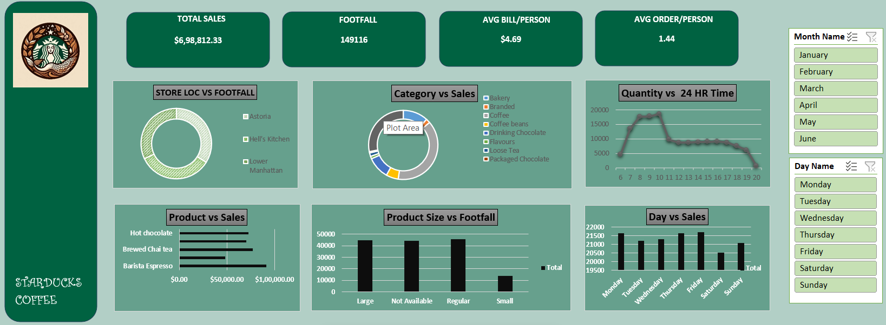

# Starducks Coffee Sales Dashboard Using MS-Excel

Welcome to the **Starducks Coffee Sales Dashboard** project! This project provides key insights into the monthly sales trends, product category performance, and store performance of Starducks Coffee across different locations. The dashboard is designed to help identify areas of improvement and strategic growth opportunities for the business.

## Problem Statement

The primary goal of this project is to analyze the sales data of Starducks Coffee across various locations and product categories to identify key trends and actionable insights that can drive future growth. Key aspects include:

- Monthly sales trends
- Product category performance
- Store sales analysis
- Peak sales hours and time-based trends

## Dashboard Preview

## Key Insights

### 1. Monthly Sales Trends
- **Highest Sales in June**: June recorded the highest total sales with $166,485.88, showing a strong growth momentum.
- **Sales Dip in February**: A significant drop in February’s sales compared to January and March was observed, which requires further investigation.

### 2. Product Category Insights
- **Coffee as the Leading Category**: Coffee dominates sales with $269,952.45, far surpassing other categories like tea and bakery. Promotional campaigns focused on coffee could be beneficial.

### 3. Store Performance
- **Hell’s Kitchen Store Leads in Sales**: The Hell’s Kitchen store reported the highest total sales of $236,511.17. Strategies from this store could be replicated at other locations for improvement.

### 4. Peak Sales Hours
- **Morning Rush**: Peak sales occur between 8 AM and 10 AM, with the highest hourly sales recorded at 10 AM. 
- **Low Sales in the Evening**: After 7 PM, there is a noticeable drop in sales, creating an opportunity for evening promotions or events.

## Recommendations

Based on the insights from the dashboard, the following strategic recommendations are proposed:

- **Promote Coffee More Aggressively**: Introduce seasonal or specialty coffee options and loyalty programs to boost sales further.
- **Morning Hour Promotions**: Offering morning-specific promotions, such as bundled breakfast deals, could increase sales during peak morning hours.
- **Evening Strategy**: To address the drop in sales after 7 PM, explore introducing evening-specific promotions or hosting special events to attract more customers.
